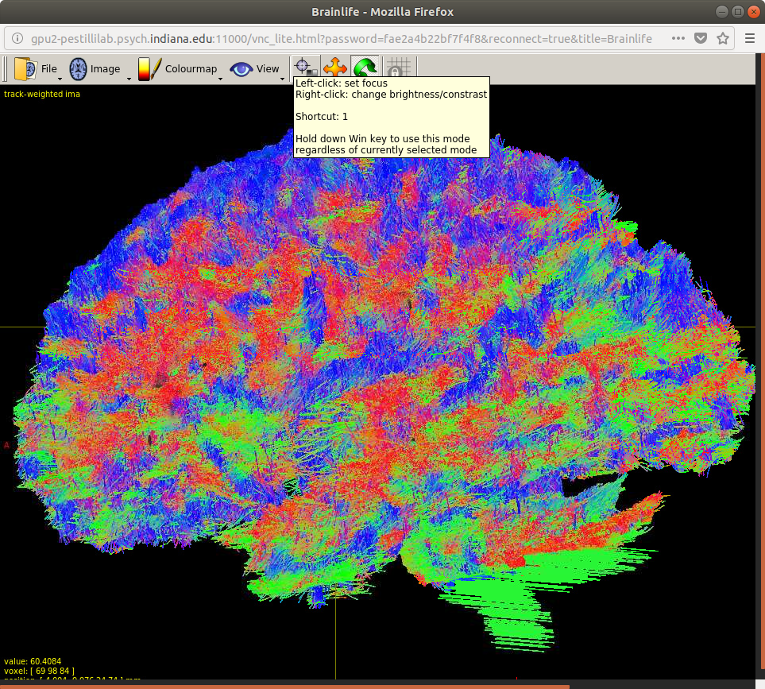

[](https://github.com/brain-life/abcd-spec)
[](https://doi.org/10.25663/bl.app.33)

# app-ensembletracking

This App uses MRtrix 0.2.12 to do ensemble tracking using tensor and constrained spherical deconvolution (csd) algorithms. 
It generates a large set of candidate streamlines using a tensor-based deterministic model, csd-based deterministic model, and csd-based probabilistic model. 
The csd-based models can be computed at lmax values of 2, 4, 6, 8, 10, and 12. 
All candidate streamlines are combined into a single track.mat file. 
If you know the max lmax value for your data input the value for max_lmax, otherwise leave it blank and it will be calculated for you. 
If you wish to use just deterministic tracking (MRtrix streamtrack parameter SD_STREAM) check do_deterministic. 
If you wish to use just probabilistic tracking (MRtrix streamtrack parameter SD_PROB) check do_probabilistic.
If you wish to use the tensor tracking (MRtrix streamtrack parameter DT_STREAM) check do_tensor. 
By default it will use all three tracking methods. 

For more information about Ensemble Tractography see Takemura, H., Caiafa, C. F., Wandell, B. A., & Pestilli, F. (2016). 
Ensemble tractography. PLoS computational biology, 12(2), e1004692.



### Authors
- Lindsey Kitchell (kitchell@indiana.edu)
- Soichi Hayashi (hayashis@iu.edu)
- Brent McPherson (bcmcpher@iu.edu)

### Project directors
- Franco Pestilli (franpest@indiana.edu)

### Funding 
[](https://nsf.gov/awardsearch/showAward?AWD_ID=1734853)
[](https://nsf.gov/awardsearch/showAward?AWD_ID=1636893)

## Running the App 

### On Brainlife.io

You can submit this App online 

* with dtiInit input [https://doi.org/10.25663/bl.app.33](https://doi.org/10.25663/bl.app.33) 
* with dwi input [https://doi.org/10.25663/bl.app.103](https://doi.org/10.25663/bl.app.103)

via the "Execute" tab.

### Running Locally (on your machine)

1. git clone this repo.
2. Inside the cloned directory, create `config.json` with something like the following content with paths to your input files.

```json
{
    "dwi": "/N/u/hayashis/Karst/testdata/108323/dwi/dwi.nii.gz",
    "bvecs": "/N/u/hayashis/Karst/testdata/108323/dwi/dwi.bvecs",
    "bvals": "/N/u/hayashis/Karst/testdata/108323/dwi/dwi.bvals",
    "freesurfer": "/N/u/hayashis/Karst/testdata/108323/freesurfer/output",
    "stepsize": 0.2,
    "minlength": 10,
    "maxlength": 200,
    "num_or_fibers": 0,
    "num_mt_fibers": 0,
    "num_vz_fibers": 0,
    "detr_curvs": "0.25 0.5 1 2 4",
    "prob_curvs": "0.25 0.5 1 2 4",
    "num_cc_fibers": 2500,
    "num_fibers": 12500,
    "do_tensor": true,
    "do_probabilistic": true,
    "do_deterministic": true
}
```

3. Launch the App by executing `main`

```bash
./main
```

### Sample Datasets

If you don't have your own input file, you can download sample datasets from Brainlife.io, or you can use [Brainlife CLI](https://github.com/brain-life/cli).

```
npm install -g brainlife
bl login
mkdir input
bl dataset download 5a050a00eec2b300611abff3 && mv 5a050a00eec2b300611abff3 input/dwi
bl dataset download 5a065cc75ab38300be518f51 && mv 5a065cc75ab38300be518f51 input/freesurfer
```

## Output

```
track.tck
```

### Dependencies

This App only requires [singularity](https://www.sylabs.io/singularity/) to run. If you don't have singularity, you will need to install following dependencies.  

  - Freesurfer 6
  - FSL 5.0.9
  - Mrtrix 0.2.12

